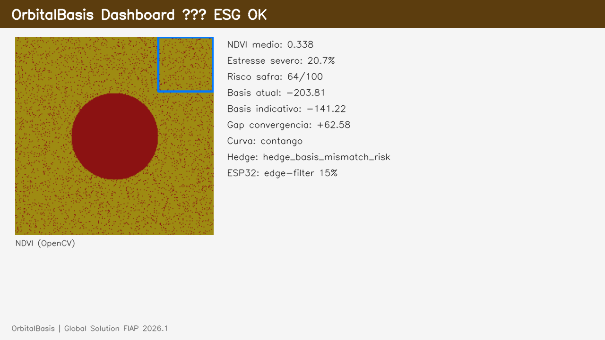

# FIAP — Global Solution 2026.1 · A Nova Economia Espacial

# OrbitalBasis — Copiloto Orbital de Comercialização Agrícola

## Nome do grupo

**OrbitalBasis Team**

## Integrantes

| Nome completo | RM | E-mail |
|---------------|-----|--------|
| Tiago Alves Cordeiro | 561791 | 561791@fiap.com.br |
| Leandro Arthur Marinho Ferreira | 565240 | 565240@fiap.com.br |
| Otavio Custodio de Oliveira | 565606 | 565606@fiap.com.br |
| Matheus José Parra | 561907 | 561907@fiap.com.br |

> Se o e-mail institucional for diferente, atualize esta tabela e o PDF antes do envio.

## Professores

### Tutor(a)

- _[Nome do tutor — preencher conforme turma]_

### Coordenador(a)

- _[Nome do coordenador — preencher conforme turma]_

## Descrição

O **OrbitalBasis** é um copiloto de comercialização agrícola que une **Economia Espacial** (dados orbitais), **edge IoT** e **mercado físico** de commodities.

A POC processa bandas Red/NIR em NDVI matricial (OpenCV), prediz **risco de safra** com Random Forest treinado (MAE 0,024 · R² 0,9999 em dataset sintético), ingere telemetria ESP32 com filtro de banda na borda, consulta PTAX/B3 com fallback, calcula basis/PPE e curva de futuros, aplica **governança ESG** (Red Flag em APP com bloqueio automatizado de originação) e gera briefing via **RAG** (ChromaDB + LangChain).

Camada distribuída: **FastAPI** (`/api/v1/analysis`, `/api/v1/hardware/telemetry`) para core logic e modelos matemáticos, e um poderoso **Dashboard em Next.js (React)** com interface vívida em Dark Mode para telemetria de 4 commodities simultâneas. Material **educacional** — não constitui recomendação de investimento.

**OrbitalBasis Team. QUERO CONCORRER.**

---

## Estrutura de pastas

Alinhada ao [template FIAP TIAO 2026](https://github.com/CaiqueFiap-2026/TEMPLATE-TIAO-2026) (`src`, `data`, `docs`), com extensões justificadas para MVP:

```
src/          # Código-fonte (NDVI, ML, basis, ESG, RAG, API, dashboard, ESP32)
data/         # CSV sintéticos, knowledge RAG, training/
docs/         # Arquitetura, API, PDF, roteiro vídeo, checklists
assets/       # Screenshots, NDVI, diagrama arquitetura, IoT (FIAP)
models/       # yield_risk_v1.joblib + métricas
scripts/      # Treino ML, demo, RAG, start_all, generate_assets
tests/        # pytest (53 testes)
notebooks/    # Colab gratuito (treino ML)
```

---

## Links e observações

| Item | URL |
|------|-----|
| Repositório GitHub | https://github.com/tiagoalvescordeiro/orbitalbasis |
| Vídeo (YouTube, **não listado**) | _[preencher após gravação]_ |
| PDF único (entrega) | [docs/OrbitalBasis_Entrega_FIAP_2026.1.pdf](docs/OrbitalBasis_Entrega_FIAP_2026.1.pdf) |
| Arquitetura | [docs/ARQUITETURA.md](docs/ARQUITETURA.md) |
| PDF — texto para Word | [docs/PDF_ENTREGA_FIAP_COPIAR_WORD.txt](docs/PDF_ENTREGA_FIAP_COPIAR_WORD.txt) |
| Checklist vídeo 5 min | [docs/CHECKLIST_GRAVACAO_5MIN.md](docs/CHECKLIST_GRAVACAO_5MIN.md) |
| Checklist entrega final | [docs/ENTREGA_FINAL_CHECKLIST.md](docs/ENTREGA_FINAL_CHECKLIST.md) |
| Conformidade enunciado FIAP | [docs/CONFORMIDADE_FIAP.md](docs/CONFORMIDADE_FIAP.md) |
| Assets visuais (dashboard, NDVI, arquitetura) | [assets/README.md](assets/README.md) |

**Pré-visualização do dashboard:**



**Competição / pódio:** o grupo **OrbitalBasis Team** declara interesse em participar do **pódio** da Global Solution 2026.1 e autoriza avaliação do vídeo e do repositório para esse fim.

**Decisões técnicas:** dados de mercado e bandas satelitais em modo demo/sintético na POC; labels de ML gerados por heurística documentada em `models/yield_risk_v1_metrics.json`.

---

## Como executar o código

**Pré-requisitos:** Python 3.11+, `pip`, opcional Docker.

```bash
git clone https://github.com/tiagoalvescordeiro/orbitalbasis.git
cd orbitalbasis
python -m venv .venv
.venv\Scripts\activate          # Windows
pip install -r requirements.txt
python scripts/index_rag.py     # opcional — RAG
python scripts/generate_assets.py  # PNGs para PDF e README
pytest tests/ -q                # 53 testes
```

**Terminal 1 — API:**

```bash
uvicorn src.applications.api.main:app --reload --port 8000
```

**Terminal 2 — Dashboard Next.js (Web App):**

```bash
cd src/applications/web_app
npm install
npm run dev
```

- API: http://127.0.0.1:8000/docs  
- Dashboard: http://localhost:3000  

**Docker:** `docker compose up --build`

**Treino ML (local):**

```bash
python scripts/generate_training_dataset.py --rows 8000
python scripts/train_yield_risk.py
```

---

## Histórico de lançamentos

| Versão | Data | Descrição |
|--------|------|-----------|
| 1.0.0 | 03/06/2026 | Entrega Global Solution 2026.1 — MVP OrbitalBasis (ML, NDVI, ESG, API, dashboard, RAG) |
| 1.1.0 | 09/06/2026 | Migração para Dashboard Next.js + Tailwind, Suporte a 4 Culturas Simultâneas (Soja, Milho, Café, Boi), Telemetria IoT e refatoração do pipeline sintético NDVI. |

---

## Documentação técnica

- [Especificação da API](docs/API_SPECIFICATION.md)
- [Roteiro de vídeo 5 min](docs/ROTEIRO_DO_VIDEO.md)
- [ML local](docs/ML_GETTING_STARTED.md) · [Colab gratuito](docs/ML_COLAB_GRATUITO.md) · [Vertex GCP (opcional)](docs/ML_VERTEX_GCP.md)

---

## Licença

Projeto acadêmico — FIAP Global Solution 2026.1.  
Licenciado sob [Creative Commons Attribution 4.0 International (CC BY 4.0)](LICENSE), conforme [modelo Git FIAP](https://github.com/CaiqueFiap-2026/TEMPLATE-TIAO-2026).
