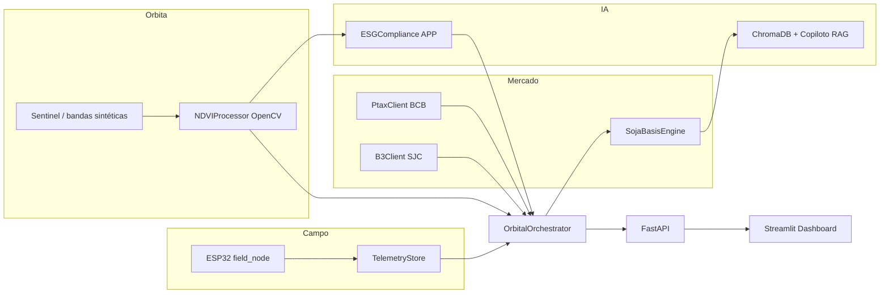

# OrbitalBasis — Arquitetura do Sistema

**Global Solution FIAP 2026.1** · *A Nova Economia Espacial*  
**Curso:** Inteligência Artificial (2º ano) · Fases 3 e 4

---

## 1. Visão geral

O OrbitalBasis é um copiloto de **comercialização agrícola** que funde três camadas:

1. **Órbita** — imagens satelitais (bandas Red/NIR) processadas localmente (NDVI matricial).
2. **Campo** — telemetria ESP32 com *edge computing* (transmissão filtrada).
3. **Mercado** — PTAX (BCB), cotação soja B3, motor de **basis/PPE** e briefing **RAG**.



---

## 2. Componentes principais

| Módulo | Caminho | Responsabilidade |
|--------|---------|------------------|
| `NDVIProcessor` | `src/ml_models/ndvi_processor.py` | `(NIR−Red)/(NIR+Red)`, limiarização, overlay |
| `ESGCompliance` | `src/core_logic/esg_compliance.py` | Cruzamento talhão × APP, Red Flag |
| `SojaBasisEngine` | `src/core_logic/basis_engine.py` | Basis, PPE, curva, convergência, hedge educacional |
| `OrbitalOrchestrator` | `src/core_logic/orchestrator.py` | Pipeline ponta a ponta |
| `PtaxClient` / `B3Client` | `src/market_data/` | Mercado com fallback CSV |
| `TelemetryStore` | `src/data_collection/serial_mqtt_reader.py` | Buffer ESP32 / simulador |
| `Commercial Copilot` | `src/rag/commercial_copilot.py` | Briefing hybrid / LLM |
| API | `src/applications/api/main.py` | REST distribuído |
| Dashboard | `src/applications/dashboard/app.py` | UI demo / vídeo |

---

## 3. Fluxo de dados (análise)

```
1. MarketDataService → MarketSnapshot + curva futuros
2. simulate_sentinel_bands / bandas reais → NDVI + máscaras
3. check_app_infringement → ESGVerdict
4. YieldContext ← NDVI summary + umidade ESP32
5. analyze_soja → BasisResult
6. to_rag_context + generate_briefing_markdown
7. analysis_to_dict → JSON (API / Dashboard)
```

**Parâmetros de demo (API/Dashboard):**

- `esg_red_flag` — força violação APP para Red Flag.
- `soil_moisture_pct` — umidade (ou último pacote ESP32).
- `saca_rs` — preço físico R$/saca na origem.

---

## 4. Integração por disciplina (FIAP)

| Disciplina | Evidência no projeto |
|------------|----------------------|
| Visão computacional | Cálculo NDVI em matriz; segmentação verde/amarelo/vermelho |
| Machine Learning | `yield_risk_hint` agregado a partir de NDVI + estresse |
| IA generativa / RAG | ChromaDB + LangChain (`ORBITAL_RAG_MODE`) |
| IoT / Edge | Firmware filtro 15% + janela horária; `TelemetryStore` |
| Apps distribuídas | FastAPI + Streamlit consumindo `/api/v1/analysis` |
| Web scraping | `ptax_client.py`, `b3_client.py` com fallback |

---

## 5. APIs REST

Base URL: `http://localhost:8000`

### `GET|POST /api/v1/analysis`

**Query / body:**

| Campo | Tipo | Default |
|-------|------|---------|
| `esg_red_flag` | bool | false |
| `soil_moisture_pct` | float | 22.0 |
| `saca_rs` | float | 138.50 |

**Resposta (resumo):** `ndvi_summary`, `ndvi_overlay_png_b64`, `esg`, `basis`, `futures_curve`, `rag_context`, `briefing_markdown`, `market_meta`.

### `POST /api/v1/hardware/telemetry`

Body JSON (pacote ESP32 edge-filtered):

```json
{
  "node": "esp32_01",
  "soil_moisture_pct": 22.5,
  "local_mean": 24.1,
  "local_std": 2.3,
  "tx_reason": "anomaly_15pct",
  "edge_filtered": true
}
```

### `GET /api/v1/hardware/telemetry?limit=15`

Lista pacotes recentes.

### `GET /health`

Health check.

Documentação interativa: `/docs` (Swagger).

---

## 6. RAG (ChromaDB)

- **Knowledge:** `data/rag/knowledge/*.md`
- **Índice:** `data/chroma_db/` (gerado por `scripts/index_rag.py`, ignorado no git)
- **Modos:** `ORBITAL_RAG_MODE=deterministic|hybrid|llm`

---

## 7. Deploy

### Local

```bash
pip install -r requirements.txt
python scripts/index_rag.py
uvicorn src.applications.api.main:app --reload --port 8000
streamlit run src/applications/dashboard/app.py
```

### Docker

```bash
docker compose up --build
```

- API: `:8000`
- Dashboard: `:8501` (usa API interna `http://api:8000`)

---

## 8. Compliance

- Briefing e dashboard: **material educacional**.
- Não constitui recomendação de investimento nem ordem de operação em derivativos.
- ESG Red Flag bloqueia originação/hedge apenas no contexto da POC.

---

## 9. Equipe

| Integrante | RM |
|------------|-----|
| Tiago Alves Cordeiro | 561791 |
| Leandro Arthur Marinho Ferreira | 565240 |
| Otavio Custodio de Oliveira | 565606 |
| Matheus José Parra | 561907 |

---

## 10. Referências técnicas

- Material derivativos agrícolas (basis, PPE, convergência, hedge).
- BCB OData PTAX: `olinda.bcb.gov.br` — serviço PTAX v1.
- B3 — mercado de derivativos (scraping + fallback).
- Global Solution FIAP 2026.1 — *A Nova Economia Espacial*.
